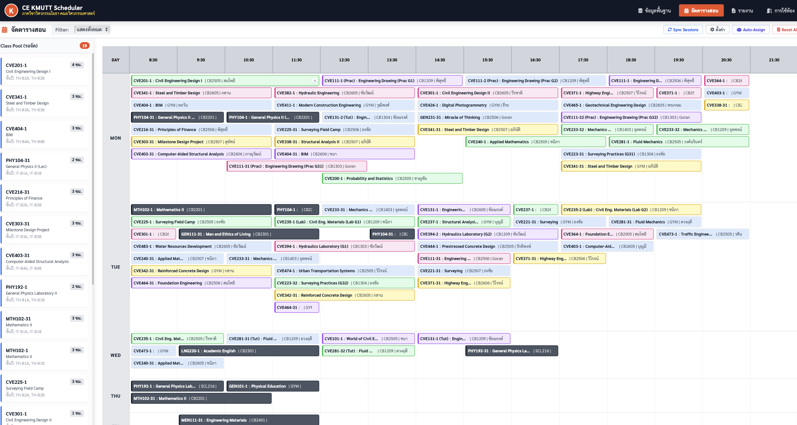

# CE KMUTT Scheduler - TypeScript Full Stack Application

A modern full-stack class scheduling application for KMUTT's Civil Engineering Department, rebuilt from the original HTML/JavaScript version to use **TypeScript**, **React**, **Node.js/Express**, and **SQLite**.



## 🎯 Overview

This application helps manage class schedules for the Civil Engineering Department at King Mongkut's University of Technology Thonburi (KMUTT). It provides:

- **Data Management**: Manage years, rooms, instructors, and subjects
- **Interactive Scheduler**: Drag-and-drop interface for scheduling classes
- **Auto-Assignment**: Intelligent algorithm to automatically schedule classes
- **Reports**: Workload reports and room utilization analytics
- **Conflict Detection**: Prevents scheduling conflicts for instructors and rooms
- **Docker Deployment**: Production-ready containerized deployment

## ✨ Features

### Core Functionality
✅ **Drag & Drop Scheduling** - Intuitive HTML5 drag-and-drop interface
✅ **Auto-Assign Algorithm** - Priority-based automatic scheduling
✅ **Real-time Conflict Detection** - Prevents instructor, room, and student conflicts
✅ **Constraint Validation** - Department constraints, instructor availability, room capacity
✅ **Workload Reports** - Per-instructor teaching loads with ratio distribution
✅ **Room Utilization Reports** - Weekly usage patterns for all rooms
✅ **Print-Ready Outputs** - Formatted reports for A4 printing

### Technical Features
✅ Full TypeScript implementation (Frontend + Backend)
✅ RESTful API with comprehensive CRUD operations
✅ React 18 with TanStack Query for state management
✅ SQLite database with persistent storage
✅ Docker & Docker Compose deployment
✅ Automated backup scripts
✅ Health monitoring endpoints

## 🚀 Deployment Guide

### Option 1: Docker Deployment (Recommended for Production)

**Perfect for:** Production servers, cloud deployment, easy setup

#### Prerequisites
- Docker 20.10 or higher
- Docker Compose 2.0 or higher

#### Step 1: Navigate to Project Directory
```bash
cd /Users/sompoteyouwai/env1/time_shcedule
```

#### Step 2: Deploy Using Automated Script
```bash
# Make scripts executable (first time only)
chmod +x deploy.sh backup.sh

# Deploy the application
./deploy.sh
```

The script will:
- ✅ Check Docker installation
- ✅ Stop existing containers
- ✅ Build Docker images
- ✅ Start services with health checks
- ✅ Display access URLs

#### Step 3: Access the Application
- **Frontend**: http://localhost
- **Backend API**: http://localhost:3000
- **Health Check**: http://localhost:3000/api/health

#### Manual Docker Deployment (Alternative)
```bash
# Build and start containers
docker-compose up -d --build

# View logs
docker-compose logs -f

# Check status
docker-compose ps
```

#### Database Backup
```bash
# Create automatic backup
./backup.sh

# Manual backup
docker cp kmutt-scheduler-backend:/app/data/scheduler.db ./backup.db
```

#### Stop Services
```bash
# Stop containers (keeps data)
docker-compose down

# Stop and remove volumes (⚠️ deletes database)
docker-compose down -v
```

📖 **For detailed Docker documentation, see [DEPLOYMENT.md](./DEPLOYMENT.md)**

---

### Option 2: Development Mode

**Perfect for:** Local development, testing, debugging

#### Prerequisites
- Node.js 18 or higher
- npm 9 or higher

#### Step 1: Backend Setup

```bash
# Navigate to backend directory
cd backend

# Install dependencies
npm install

# Initialize database (creates tables)
npm run db:init

# Seed with sample data (optional but recommended)
npm run db:seed

# Start development server
npm run dev
```

✅ Backend runs on: `http://localhost:3000`
✅ Sample data includes: 26 years, 51 rooms, 34 instructors, 69 subjects

#### Step 2: Frontend Setup

Open a **new terminal** window:

```bash
# Navigate to frontend directory
cd frontend

# Install dependencies
npm install

# Start development server
npm run dev
```

✅ Frontend runs on: `http://localhost:5173` (or 5174-5175 if port is busy)

#### Step 3: Access the Application

Open your browser: `http://localhost:5173`

#### Development Commands

**Backend:**
```bash
npm run dev          # Start with hot reload
npm run build        # Build TypeScript to JavaScript
npm run db:init      # Reset database (empty tables)
npm run db:seed      # Populate with sample data
```

**Frontend:**
```bash
npm run dev          # Start with hot reload
npm run build        # Build for production
npm run preview      # Preview production build
npm run lint         # Run ESLint
```

---

## 🏗️ Architecture

### Technology Stack

**Frontend:**
- React 18 with TypeScript
- Vite (build tool & dev server)
- TanStack Query (data fetching & caching)
- Tailwind CSS (styling)
- HTML5 Drag & Drop API

**Backend:**
- Node.js with Express
- TypeScript
- SQLite (better-sqlite3)
- RESTful API design

**Deployment:**
- Docker & Docker Compose
- Nginx (frontend web server)
- Multi-stage builds for optimization

### System Architecture

```
┌─────────────────────────────────────────┐
│  User Browser (Port 80)                 │
└──────────────┬──────────────────────────┘
               │
┌──────────────▼──────────────────────────┐
│  Frontend Container (Nginx)             │
│  • Serves React build                   │
│  • Proxies /api/* to backend            │
│  • Gzip compression                     │
│  • Static asset caching                 │
└──────────────┬──────────────────────────┘
               │
┌──────────────▼──────────────────────────┐
│  Backend Container (Node.js/Express)    │
│  • RESTful API (Port 3000)              │
│  • Auto-initialize database             │
│  • Health checks                        │
└──────────────┬──────────────────────────┘
               │
┌──────────────▼──────────────────────────┐
│  SQLite Database (Docker Volume)        │
│  • Persistent storage                   │
│  • Auto-backup capable                  │
└─────────────────────────────────────────┘
```

## 📁 Project Structure

```
time_shcedule/
├── backend/                      # Backend API server
│   ├── src/
│   │   ├── database/            # Database init, seed, connection
│   │   │   ├── init.ts         # Schema creation
│   │   │   ├── seed.ts         # Sample data
│   │   │   └── connection.ts   # SQLite connection
│   │   ├── routes/             # API route handlers
│   │   │   ├── years.ts        # Year management
│   │   │   ├── rooms.ts        # Room management
│   │   │   ├── instructors.ts  # Instructor management
│   │   │   ├── subjects.ts     # Subject management
│   │   │   ├── sessions.ts     # Session scheduling + auto-assign
│   │   │   └── config.ts       # Settings & constraints
│   │   ├── server.ts           # Express server
│   │   └── start-production.ts # Production startup
│   ├── Dockerfile              # Backend container config
│   ├── package.json
│   └── tsconfig.json
│
├── frontend/                    # React frontend app
│   ├── src/
│   │   ├── api/                # API client
│   │   ├── components/         # React components
│   │   │   ├── data/          # Data management UI
│   │   │   ├── scheduler/     # Scheduler interface
│   │   │   └── reports/       # Report generation
│   │   ├── hooks/             # Custom React hooks
│   │   ├── types/             # TypeScript types
│   │   ├── App.tsx            # Main app component
│   │   └── main.tsx           # Entry point
│   ├── Dockerfile             # Frontend multi-stage build
│   ├── nginx.conf             # Nginx configuration
│   ├── package.json
│   └── vite.config.ts
│
├── docs/                       # Documentation assets
│   └── images/                # Screenshots
│
├── docker-compose.yml         # Container orchestration
├── deploy.sh                  # Automated deployment script
├── backup.sh                  # Database backup script
├── DEPLOYMENT.md              # Detailed deployment guide
├── .env.example              # Environment variables template
├── Scheduler.html            # Original HTML version (reference)
└── README.md                 # This file
```

## 📊 Database Schema

### Core Tables

**years** - Student year/level definitions
- `id`, `name`, `count` (number of students)

**rooms** - Classroom definitions
- `id`, `name`, `capacity`, `building`

**instructors** - Faculty members
- `id`, `prefix`, `first_name`, `last_name`, `field`
- `availability` (JSON) - Availability matrix per day/slot

**subjects** - Course definitions
- `id`, `code`, `section`, `name`, `credit`, `workload`
- `year` (JSON array) - Target student years
- `instructors` (JSON array) - Teaching instructors with workload ratios
- `is_fixed` - Lock schedule flag

**sessions** - Scheduled class sessions
- `id`, `subject_id`, `day`, `start_slot`, `duration`, `room_id`

**config** - Application settings
- `key`, `value` (JSON) - Settings, constraints, academic year

## 🔌 API Endpoints

### Years Management
```
GET    /api/years           # List all years
POST   /api/years           # Create new year
PUT    /api/years/:id       # Update year
DELETE /api/years/:id       # Delete year
```

### Rooms Management
```
GET    /api/rooms           # List all rooms
POST   /api/rooms           # Create new room
PUT    /api/rooms/:id       # Update room
DELETE /api/rooms/:id       # Delete room
```

### Instructors Management
```
GET    /api/instructors     # List all instructors (with availability)
POST   /api/instructors     # Create new instructor
PUT    /api/instructors/:id # Update instructor
DELETE /api/instructors/:id # Delete instructor
```

### Subjects Management
```
GET    /api/subjects        # List all subjects (with years & instructors)
POST   /api/subjects        # Create new subject
PUT    /api/subjects/:id    # Update subject
DELETE /api/subjects/:id    # Delete subject
```

### Sessions & Scheduling
```
GET    /api/sessions        # List all scheduled sessions
POST   /api/sessions        # Create session manually
PUT    /api/sessions/:id    # Update session (drag & drop)
DELETE /api/sessions/:id    # Delete session
POST   /api/sessions/sync   # Sync sessions from subjects
POST   /api/sessions/auto-assign  # Auto-assign unscheduled sessions
```

### Configuration
```
GET    /api/config/settings           # Get application settings
PUT    /api/config/settings           # Update settings
GET    /api/config/acad-year          # Get academic year
PUT    /api/config/acad-year          # Update academic year
GET    /api/config/dept-constraints   # Get department constraints
PUT    /api/config/dept-constraints   # Update constraints
```

### Health Monitoring
```
GET    /health              # Backend health check
GET    /api/health          # Alternative health endpoint
```

## 🤖 Auto-Assignment Algorithm

The intelligent scheduling algorithm uses a **greedy approach** with **priority-based sorting**:

### 1. Priority Sorting
Sessions are sorted by:
1. **Duration** (hours) - Longer classes scheduled first
2. **Student Count** - Larger classes scheduled first
3. **Instructor Busy Count** - Busier instructors scheduled first

### 2. Slot Testing
For each unscheduled session:
- Test all days (MON-SUN)
- Test all time slots (0-13, representing 8:30-22:30)
- Test all available rooms (sorted by capacity, smallest first)

### 3. Constraint Validation
Each slot/room combination is validated against:
- ✅ **Time Limit**: Must fit within operating hours (14 slots max)
- ✅ **Fixed Subjects**: Cannot move locked schedules
- ✅ **Department Constraints**: Hard-blocked and soft-blocked times
- ✅ **Instructor Availability**: Per-instructor availability matrix
- ✅ **Room Capacity**: Must accommodate all enrolled students
- ✅ **Student Conflicts**: Same year cannot have overlapping classes
- ✅ **Instructor Conflicts**: Same instructor cannot teach simultaneously
- ✅ **Room Conflicts**: Prevents double-booking rooms

### 4. Assignment
Assigns to the **first valid** slot/room combination found.

## 🐳 Docker Deployment Files

### Created Files
- **`docker-compose.yml`** - Orchestrates frontend + backend + database volume
- **`backend/Dockerfile`** - Node.js Alpine with TypeScript build
- **`frontend/Dockerfile`** - Multi-stage: Vite build → Nginx serve
- **`frontend/nginx.conf`** - Reverse proxy + SPA routing + compression
- **`deploy.sh`** - Automated deployment with health checks
- **`backup.sh`** - Automated database backup with compression
- **`DEPLOYMENT.md`** - Comprehensive deployment documentation

### Docker Commands Reference

```bash
# Deploy
./deploy.sh                              # Automated deployment
./deploy.sh --skip-build                 # Skip rebuild (faster)
./deploy.sh --backup                     # Backup before deploy

# Manual operations
docker-compose up -d --build             # Build and start
docker-compose down                      # Stop services
docker-compose logs -f                   # View logs (all services)
docker-compose logs -f backend           # View backend logs only
docker-compose restart backend           # Restart backend
docker-compose ps                        # Check status

# Database operations
./backup.sh                              # Create backup
docker cp kmutt-scheduler-backend:/app/data/scheduler.db ./backup.db
docker exec -it kmutt-scheduler-backend sqlite3 /app/data/scheduler.db

# Container access
docker exec -it kmutt-scheduler-backend sh    # Backend shell
docker exec -it kmutt-scheduler-frontend sh   # Frontend shell

# Cleanup
docker-compose down -v                   # Remove volumes (⚠️ deletes data)
docker image prune -f                    # Remove unused images
docker system prune -a                   # Clean everything
```

## 🎨 User Interface

The application features a modern, responsive interface with:

- **KMUTT Branding**: Official KMUTT orange theme
- **Dark Mode Support**: (Future enhancement)
- **Thai Language**: Full Thai language support
- **Responsive Design**: Works on desktop and tablets
- **Print Optimization**: Reports formatted for A4 printing

### Main Sections

1. **ข้อมูลพื้นฐาน (Data Management)**
   - Years/Levels management
   - Rooms and buildings
   - Instructors with availability
   - Subjects/Courses with instructors

2. **จัดตารางสอน (Scheduler)**
   - Weekly calendar grid (7 days × 14 time slots)
   - Drag-and-drop interface
   - Class pool sidebar (unscheduled classes)
   - Auto-assign button
   - Real-time conflict detection

3. **รายงาน (Reports)**
   - Workload Report: Per-instructor teaching loads
   - Room Report: Weekly room utilization

## 🔧 Configuration

### Application Settings

Configure via UI or API (`/api/config/settings`):

```json
{
  "check_room_constraints": 1,       // Enable room validation
  "check_instructor_constraints": 1, // Enable instructor availability check
  "check_dept_constraints": 1        // Enable department constraints
}
```

### Department Constraints

Define blocked time periods per day:

```json
{
  "day": "MON",
  "hard_blocked": [0, 1, 12, 13],   // Completely unavailable (red)
  "soft_blocked": [8, 9, 10, 11]    // Not recommended (yellow)
}
```

### Time Slots

14 slots per day (8:30 AM - 10:30 PM):
```
Slot 0:  08:30-09:30    Slot 7:  15:30-16:30
Slot 1:  09:30-10:30    Slot 8:  16:30-17:30
Slot 2:  10:30-11:30    Slot 9:  17:30-18:30
Slot 3:  11:30-12:30    Slot 10: 18:30-19:30
Slot 4:  12:30-13:30    Slot 11: 19:30-20:30
Slot 5:  13:30-14:30    Slot 12: 20:30-21:30
Slot 6:  14:30-15:30    Slot 13: 21:30-22:30
```

## 🐛 Troubleshooting

### Common Issues

**Port already in use**
```bash
# Check what's using the port
lsof -i :80
lsof -i :3000

# Change ports in docker-compose.yml
```

**Database not initializing**
```bash
# Check logs
docker-compose logs backend

# Manually initialize
docker exec -it kmutt-scheduler-backend npm run db:init
docker exec -it kmutt-scheduler-backend npm run db:seed
```

**Frontend can't connect to backend**
```bash
# Check backend is running
docker-compose ps

# Check nginx proxy configuration
docker exec -it kmutt-scheduler-frontend cat /etc/nginx/conf.d/default.conf

# View backend logs
docker-compose logs backend
```

**Build errors**
```bash
# Clean rebuild
docker-compose down
docker-compose build --no-cache
docker-compose up -d
```

### Debug Mode

```bash
# View real-time logs
docker-compose logs -f

# Check container health
docker inspect kmutt-scheduler-backend | grep -A 10 Health
docker inspect kmutt-scheduler-frontend | grep -A 10 Health

# Test endpoints
curl http://localhost:3000/api/health
curl http://localhost/health
```

## 📝 Migration from Original

This is a complete rebuild of `Scheduler.html`:

### ✅ What Changed
- Monolithic HTML → Separated frontend/backend architecture
- localStorage → SQLite database with persistent storage
- Vanilla JavaScript → TypeScript (full type safety)
- Inline CSS → Tailwind CSS (utility-first)
- No deployment → Docker containerization

### ✅ What Remains
- Same UI/UX design and layout
- Same KMUTT branding (orange theme)
- Same scheduling algorithm logic
- Same Thai language interface
- Same constraint validation rules

## 🤝 Contributing

When adding new features:

1. **Database**: Update schema in `backend/src/database/init.ts`
2. **Types**: Add TypeScript types to both `backend/src/types/` and `frontend/src/types/`
3. **API**: Create endpoints in `backend/src/routes/`
4. **Frontend**: Create components in `frontend/src/components/`
5. **Tests**: Add tests for new functionality
6. **Docs**: Update README and DEPLOYMENT.md

## 📄 License

MIT License

## 👥 Credits

**Original Application:**
CE KMUTT Scheduler v22.0 (Stable & Final)
ภาควิชาวิศวกรรมโยธา คณะวิศวกรรมศาสตร์
King Mongkut's University of Technology Thonburi

**TypeScript Rebuild:**
Department of Civil Engineering, KMUTT

---

**Built with** ❤️ **using TypeScript, React, Node.js & Docker**
